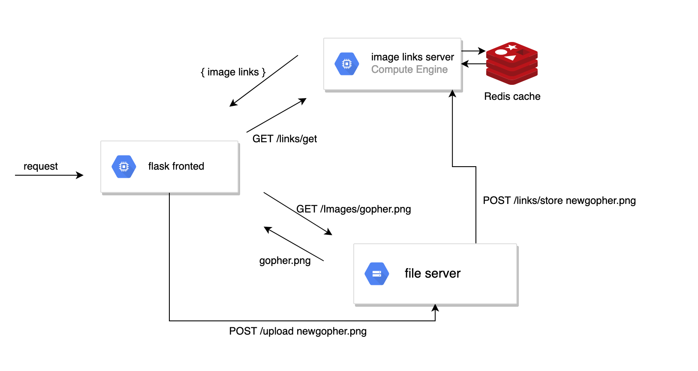

# nightmare-services

**Gopher Gallery** is a simple microservice made for demo purposes. 
As the name implies it is an image gallery where users can upload images of gophers. 

## Architecture 

Gopher Gallery is composed of 3 microservices that communicate over HTTP 

## Services 

| Service  | Language  | Description                            | 
| ---------| -------   |--------------------------------------  |
| Frontend | Python    |  renders images on the home page and handles image uploads | 
| links-store | python | stores the urls to all uploaded images |
| image-server | Go    | serves all image to the frontend and processes uploaded images |

## Deploying 

